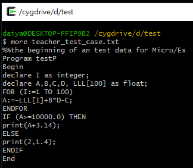
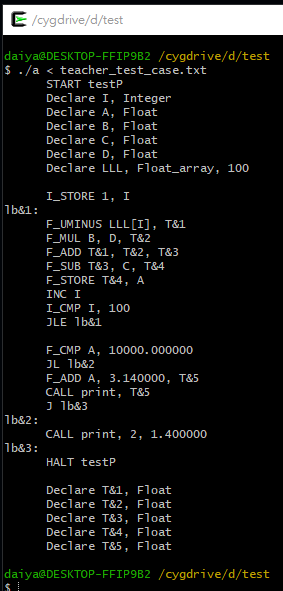
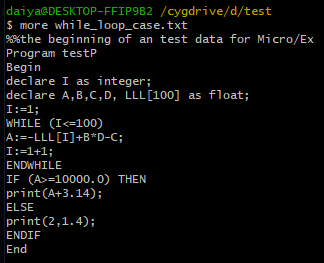
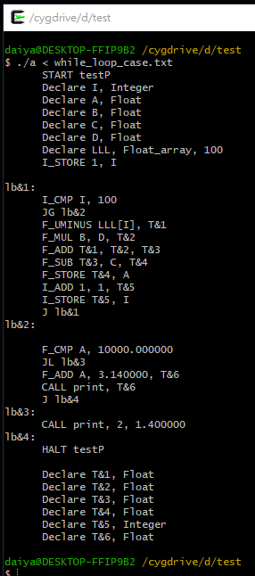

## 📝 Micro/EX Compiler Code Generation
使用 Lex、Yacc 與 C 實作 Micro/EX 語言的編譯器(非完整支援)。

此期末專題包含 lexical analysis、syntax parsing 與基礎的 code generation。

這裡僅實作能編譯教授指定測資的編譯器，像是巢狀迴圈等複雜結構就無法。

### 🔗 1132 NTNU CSIE Compiler Design Final Project

- 課程代碼: CSC0004 [課程教材連結](https://web.ntnu.edu.tw/~ghhwang/course.html)(三校聯盟課程代碼: 3N6463701)
- 授課老師: Prof. Gwan-Hwan Hwang(黃冠寰 教授)
- 課程用書:
  - Crafting a Compiler with C, by Richard J. LeBlanc, Jr.
  - Lex & Yacc, by John R. Levine, Tony Mason, and Doug Brown, O’Reilly & Associates
- 如果想要每週作業的題型，歡迎來信: daiyan.6666@gmail.com

### 📁 壓縮檔內容
- `microex.y` - yacc grammar 與 semantic rules for parsing Micro/EX。
- `microex.l` - lexical analyzer(分析 Micro/EX 程式碼的 token)。
- `microex.h` - 內為 symbol table 與表達式屬性的定義。
- `teacher_test_case.txt` - 教授提供的測資。(90分項)
- `lexical_error_case.txt` - 使用非法變數名稱 (像是 @@@)，會報 lexical error 的測資。(加分項)
- `undeclare_var_case.txt` - 使用未宣告的變數會報錯的測資。(加分項)
- `undeclare_array_case.txt` - 使用未宣告的陣列會報錯的測資。(加分項)
- `data_type_mismatch_case.txt` - 將 integer 與 float 進行 + - * / 運算會報錯的測資。(加分項)
- `while_loop_case.txt` - 能支援基本的 while loop 測資(非巢狀)。(加分項)

## 📦 測試結果 (點擊縮圖可放大)
| Input (teacher_test_case.txt) | Output |
|-------------|-----------------|
|  |  |

| Input (while_loop_case.txt) | Output |
|-------------|-----------------|
|  |  |

## 🚀 如何使用
使用以下指令編譯程式:
```
yacc -d microex.y
lex microex.l
gcc lex.yy.c y.tab.c -ly -lfl
```
編譯完應該會產生以下檔案:
- `y.tab.c`
- `y.tab.h`
- `lex.yy.c`
- `a.exe` or `a.out`

輸入以下指令把測資丟進執行檔:
```
./a < teacher_test_case.txt
./a < lexical_error_case.txt
./a < undeclare_var_case.txt
./a < undeclare_array_case.txt
./a < data_type_mismatch_case.txt
./a < while_loop_case.txt
```
